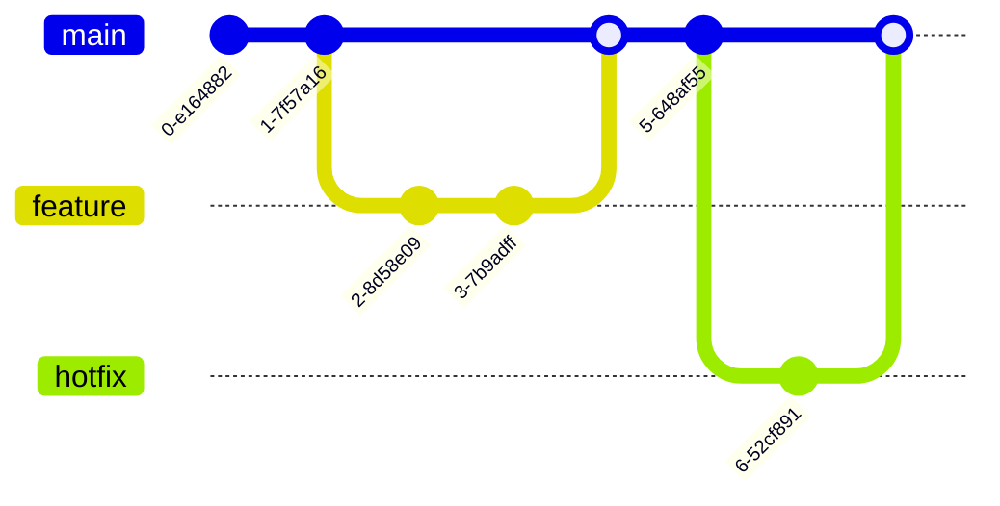

Mermaid is a powerful tool for creating diagrams and visualizations directly in Markdown. This post demonstrates the various diagram types supported.

## Flowchart

Flowcharts are great for showing processes and decision trees:


## Sequence Diagram

Perfect for showing interactions between systems or components:


## Class Diagram

Useful for documenting object-oriented designs:


## State Diagram

Great for showing state machines and transitions:


## Entity Relationship Diagram

Perfect for database schema documentation:


## Gantt Chart

Ideal for project timelines:


## Pie Chart

Simple data visualization:


## Git Graph

Visualize Git branching strategies:



## Conclusion

Mermaid makes it easy to add professional diagrams to your documentation and blog posts. The diagrams are rendered client-side and automatically adapt to your site's dark/light theme!

To use Mermaid in your posts, simply wrap your diagram code in a mermaid code block:

````markdown

````
