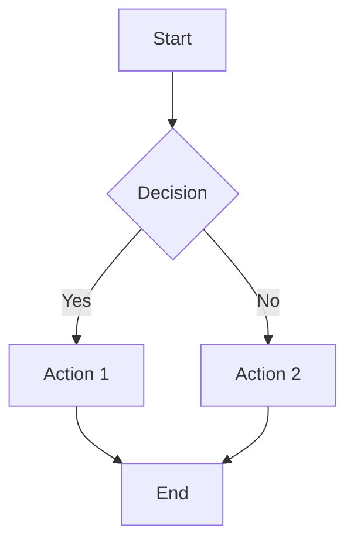

# Portfolio Theme for Hugo

A modern, responsive portfolio theme built with Hugo and Tailwind CSS. Features dark mode, customizable colors, Mermaid diagrams, search, comments, and comprehensive security with Content Security Policy.

## Table of Contents

- [Features](#features)
- [Installation](#installation)
- [Quick Start](#quick-start)
- [Configuration](#configuration)
  - [Basic Site Parameters](#basic-site-parameters)
  - [Theme Colors](#theme-colors)
  - [Content Security Policy (CSP)](#content-security-policy-csp)
  - [Google Analytics](#google-analytics)
  - [Google AdSense](#google-adsense)
  - [Formspree Contact Form](#formspree-contact-form)
  - [Utterances Comments](#utterances-comments)
  - [Pagination](#pagination)
  - [Navigation Menu](#navigation-menu)
- [Content Types](#content-types)
  - [Blog Posts](#blog-posts)
  - [Projects](#projects)
  - [About Page](#about-page)
  - [Contact Page](#contact-page)
- [Features Documentation](#features-documentation)
  - [Dark Mode](#dark-mode)
  - [Search](#search)
  - [Mermaid Diagrams](#mermaid-diagrams)
  - [Dynamic Favicon](#dynamic-favicon)
  - [404 Page](#404-page)
- [Development](#development)
- [Deployment](#deployment)
- [License](#license)

## Features

- **Dark Mode** - System-aware dark mode with manual toggle and persistent preference
- **Tailwind CSS** - Utility-first CSS framework with custom design system
- **Responsive Design** - Mobile-first approach that looks great on all devices
- **SEO Optimized** - Built-in Open Graph and Twitter Card support
- **Fast** - Minimal JavaScript, optimized for performance
- **Accessible** - WCAG compliant with proper ARIA labels
- **Customizable Colors** - 6 color presets or custom hex colors via configuration
- **Content Security Policy** - Configurable CSP for enhanced security
- **Lunr.js Search** - Client-side full-text search
- **Mermaid Diagrams** - Support for flowcharts, sequence diagrams, and more
- **Utterances Comments** - GitHub-based commenting system
- **Dynamic Favicon** - Auto-generated SVG favicon from author initials
- **Google Analytics** - GA4 support with automatic dev mode detection
- **Google AdSense** - Configurable ad placements for monetization
- **Formspree Integration** - Easy contact form setup

## Installation

### Option 1: Git Submodule (Recommended)

```bash
# Add the theme as a submodule
git submodule add https://github.com/beingadityak/portfolio-theme themes/portfolio

# Initialize and update submodules
git submodule update --init --recursive
```

### Option 2: Direct Clone

```bash
git clone https://github.com/beingadityak/portfolio-theme themes/portfolio
```

### Install Dependencies

```bash
cd themes/portfolio
npm install
npm run build
```

### Update Hugo Configuration

```toml
theme = 'portfolio'
```

## Quick Start

1. Copy the example configuration:

```bash
cp themes/portfolio/exampleSite/hugo.toml hugo.toml
```

2. Create your content:

```bash
# Create content directories
mkdir -p content/{blog,projects}

# Create about page
cat > content/about.md << 'EOF'
---
title: "About Me"
layout: "about"
description: "Learn more about me"
skills:
  - "Go"
  - "Python"
  - "JavaScript"
experience:
  - title: "Software Engineer"
    company: "Tech Company"
    period: "2022 - Present"
    description: "Building awesome products"
---

Your about content here...
EOF

# Create contact page
cat > content/contact.md << 'EOF'
---
title: "Contact"
layout: "contact"
description: "Get in touch"
---
EOF
```

3. Start the development server:

```bash
hugo server -D
```

## Configuration

### Basic Site Parameters

```toml
baseURL = 'https://yoursite.com/'
languageCode = 'en-us'
title = 'Your Name'
theme = 'portfolio'

[params]
  author = "Your Name"
  description = "Your professional tagline"
  
  # Logo/Photo (optional) - displays in header next to your name
  # Place your image in static/images/ and reference it here
  # logo = "/images/photo.jpg"
  
  # Social links
  github = "https://github.com/username"
  linkedin = "https://linkedin.com/in/username"
  twitter = "https://x.com/username"
  email = "hello@example.com"
```

### Theme Colors

The theme supports 6 built-in color presets and custom colors.

#### Using Presets

Available presets: `blue` (default), `purple`, `green`, `orange`, `rose`, `teal`

```toml
[params.colors]
  preset = "purple"
```

#### Using Custom Colors

Specify hex colors without the `#` prefix:

```toml
[params.colors]
  primary = "6366f1"      # Primary color (used for buttons, links, etc.)
  primaryDark = "4f46e5"  # Darker shade for gradients and hover states
```

### Content Security Policy (CSP)

The theme includes a configurable Content Security Policy for enhanced security. CSP helps prevent XSS attacks and other code injection vulnerabilities.

```toml
[params.csp]
  enable = true                           # Enable/disable CSP
  upgradeInsecureRequests = true          # Upgrade HTTP to HTTPS
  blockAllMixedContent = true             # Block mixed HTTP/HTTPS content
  
  # Source directives (arrays of allowed sources)
  defaultsrc = ["'self'"]
  childsrc = ["'self'"]
  fontsrc = ["'self'", "https://fonts.gstatic.com", "https://fonts.googleapis.com"]
  formaction = ["'self'", "https://formspree.io"]
  framesrc = ["'self'", "https://utteranc.es", "https://www.youtube.com", "https://www.youtube-nocookie.com", "https://player.vimeo.com"]
  imgsrc = ["'self'", "data:", "https:"]
  objectsrc = ["'none'"]
  stylesrc = ["'self'", "'unsafe-inline'", "https://fonts.googleapis.com"]
  scriptsrc = ["'self'", "'unsafe-inline'", "https://utteranc.es", "https://cdn.jsdelivr.net"]
  connectsrc = ["'self'", "https://www.google-analytics.com"]
  mediasrc = ["'self'"]
  workersrc = ["'self'"]
  manifestsrc = ["'self'"]
  baseuri = ["'self'"]
```

#### CSP Directive Reference

| Directive | Purpose | Common Values |
|-----------|---------|---------------|
| `defaultsrc` | Fallback for other directives | `'self'` |
| `scriptsrc` | JavaScript sources | `'self'`, `'unsafe-inline'`, CDN URLs |
| `stylesrc` | CSS sources | `'self'`, `'unsafe-inline'`, font URLs |
| `imgsrc` | Image sources | `'self'`, `data:`, `https:` |
| `fontsrc` | Font sources | `'self'`, Google Fonts URLs |
| `connectsrc` | XHR/Fetch targets | `'self'`, API URLs |
| `framesrc` | iframe sources | `'self'`, embed URLs (YouTube, etc.) |
| `formaction` | Form submission targets | `'self'`, Formspree URL |
| `objectsrc` | Plugin sources | `'none'` (recommended) |

#### Adding Third-Party Services

When adding new third-party services, update the relevant CSP directives:

```toml
# Example: Adding Twitter embeds
framesrc = ["'self'", "https://platform.twitter.com"]
scriptsrc = ["'self'", "'unsafe-inline'", "https://platform.twitter.com"]
```

### Google Analytics

Add your GA4 measurement ID for analytics tracking:

```toml
[params]
  googleAnalytics = "G-XXXXXXXXXX"
```

**Features:**
- Automatically disabled in development mode (`hugo server`)
- Respects user privacy preferences
- Page view tracking out of the box

### Google AdSense

Enable monetization with Google AdSense:

```toml
[params]
  # Publisher ID (required)
  googleAdsense = "ca-pub-XXXXXXXXXXXXXXXX"
  
  # Ad slot IDs for specific placements (optional)
  adsenseSlotBlogList = "1234567890"        # Ad on blog list page
  adsenseSlotBlogPost = "1234567891"        # Ad before blog post content
  adsenseSlotBlogPostBottom = "1234567892"  # Ad after blog post content
```

**Features:**
- Automatically disabled in development mode
- Responsive ad units
- Configurable placements in blog section

#### Custom Ad Placement

Use the `adsense-ad` partial in your templates:

```html
{{ partial "adsense-ad.html" (dict 
    "context" . 
    "slot" "1234567890" 
    "format" "auto" 
    "responsive" true 
    "style" "display:block; margin:20px 0"
) }}
```

**Parameters:**
| Parameter | Required | Default | Description |
|-----------|----------|---------|-------------|
| `context` | Yes | - | Pass the current context (`.`) |
| `slot` | Yes | - | Your ad slot ID |
| `format` | No | `"auto"` | Ad format: `"auto"`, `"fluid"` |
| `responsive` | No | `true` | Enable responsive sizing |
| `style` | No | - | Custom inline CSS styles |

### Formspree Contact Form

Set up a working contact form with [Formspree](https://formspree.io):

1. Create a form at [formspree.io](https://formspree.io)
2. Copy your form ID (e.g., `mdakkzyv`)
3. Add to configuration:

```toml
[params]
  formspreeId = "mdakkzyv"
```

4. Create the contact page:

```markdown
---
title: "Contact"
layout: "contact"
description: "Get in touch with me"
---
```

The contact form includes:
- Name, email, and message fields
- Client-side validation
- Success/error feedback
- Spam protection via Formspree

### Utterances Comments

Enable GitHub-based comments on blog posts using [Utterances](https://utteranc.es):

```toml
[params.utterances]
  repo = "username/repo-name"    # GitHub repo for storing comments
  issueTerm = "pathname"         # How to map posts to issues
  label = "comments"             # Label for created issues (optional)
  theme = "github-light"         # Light mode theme
  themeDark = "github-dark"      # Dark mode theme
```

**Issue Term Options:**
- `pathname` - Map by page pathname (recommended)
- `url` - Map by full page URL
- `title` - Map by page title
- `og:title` - Map by Open Graph title

**Theme Options:**
- `github-light`, `github-dark`
- `preferred-color-scheme`
- `github-dark-orange`
- `icy-dark`, `dark-blue`, `photon-dark`
- `boxy-light`, `gruvbox-dark`

### Pagination

Configure the number of items per page:

```toml
[pagination]
  pagerSize = 5  # Number of posts per page
```

Pagination is automatically applied to blog and list pages. The pagination UI includes:
- Previous/Next navigation arrows
- Page number links
- Current page indicator (highlighted)
- "Page X of Y" info text

The pagination buttons are styled to match the theme's design system with proper dark mode support.

### Navigation Menu

Configure the main navigation:

```toml
[menu]
  [[menu.main]]
    name = "Home"
    url = "/"
    weight = 1
  [[menu.main]]
    name = "About"
    url = "/about/"
    weight = 2
  [[menu.main]]
    name = "Projects"
    url = "/projects/"
    weight = 3
  [[menu.main]]
    name = "Blog"
    url = "/blog/"
    weight = 4
  [[menu.main]]
    name = "Contact"
    url = "/contact/"
    weight = 5
```

## Content Types

### Blog Posts

Create posts in `content/blog/`:

```markdown
---
title: "Your Post Title"
date: 2024-01-15
description: "A brief description for SEO and previews"
tags: ["Tutorial", "Go", "Web Development"]
image: "/images/blog/post-image.jpg"  # Optional featured image
---

Your post content here...

## Subheading

More content with **bold** and *italic* text.

```go
// Code blocks are syntax highlighted
func main() {
    fmt.Println("Hello, World!")
}
```
```

### Projects

Create projects in `content/projects/`:

```markdown
---
title: "Project Name"
date: 2024-01-01
description: "Brief project description"
tags: ["Go", "AWS", "Docker"]
github: "https://github.com/username/project"
demo: "https://project-demo.example.com"
image: "/images/projects/project-screenshot.jpg"
---

Detailed project description...

## Features

- Feature 1
- Feature 2

## Tech Stack

- Go
- PostgreSQL
- Docker
```

### About Page

Create `content/about.md`:

```markdown
---
title: "About Me"
layout: "about"
description: "Learn more about my background and experience"
image: "/images/profile.jpg"  # Optional profile photo
skills:
  - "Go"
  - "Python"
  - "JavaScript"
  - "TypeScript"
  - "React"
  - "AWS"
  - "Kubernetes"
  - "Docker"
experience:
  - title: "Senior Software Engineer"
    company: "Tech Company"
    companyUrl: "https://techcompany.com"
    period: "2022 - Present"
    description: "Leading development of cloud-native applications"
  - title: "Software Engineer"
    company: "Startup Inc"
    period: "2020 - 2022"
    description: "Built scalable backend systems"
---

## Hello! 👋

Your about content here. This supports full Markdown including:

- Lists
- **Bold** and *italic* text
- [Links](https://example.com)
- Code blocks
```

### Contact Page

Create `content/contact.md`:

```markdown
---
title: "Contact"
layout: "contact"
description: "Get in touch with me"
---

Optional content above the contact form.
```

## Features Documentation

### Dark Mode

The theme includes automatic dark mode support:

- **System Detection** - Automatically matches system preference
- **Manual Toggle** - Click the sun/moon icon in the header
- **Persistent Preference** - Saved to localStorage
- **No Flash** - Inline script prevents white flash on load

### Search

Full-text search powered by Lunr.js:

1. Create `content/search.md`:

```markdown
---
title: "Search"
layout: "search"
outputs:
  - html
  - json
---
```

2. Add JSON output format to `hugo.toml`:

```toml
[outputs]
  home = ["HTML", "RSS", "JSON"]
```

The search indexes all blog posts and supports:
- Fuzzy matching
- Wildcard search
- Word-by-word search
- Real-time results

### Mermaid Diagrams

Create diagrams using Mermaid syntax in your Markdown:

````markdown

````

Supported diagram types:
- Flowcharts
- Sequence diagrams
- Class diagrams
- State diagrams
- Entity Relationship diagrams
- Gantt charts
- Pie charts
- And more...

Diagrams automatically adapt to dark/light mode.

### Dynamic Favicon

The theme generates a dynamic SVG favicon based on:
- Author initials (from `params.author`)
- Theme colors (from `params.colors`)

No need to create favicon files - it's generated automatically!

### 404 Page

A custom 404 page is included with:
- Styled "404" display
- Helpful navigation links
- Search suggestion
- Links to main menu items

## Development

### Prerequisites

- Hugo Extended v0.120.0+
- Node.js 18+
- npm or yarn

### Setup

```bash
# Clone the repository
git clone https://github.com/beingadityak/portfolio-theme themes/portfolio

# Install dependencies
cd themes/portfolio
npm install

# Watch for CSS changes
npm run dev
```

### Building CSS

```bash
# Development (with watch)
npm run dev

# Production build
npm run build
```

### Project Structure

```
themes/portfolio/
├── assets/
│   └── css/
│       └── main.css          # Tailwind CSS source
├── layouts/
│   ├── _default/
│   │   ├── baseof.html       # Base template
│   │   ├── list.html         # List pages
│   │   ├── single.html       # Single pages
│   │   ├── search.html       # Search page
│   │   └── about.html        # About page
│   ├── blog/
│   │   ├── list.html         # Blog list
│   │   └── single.html       # Blog post
│   ├── projects/
│   │   └── list.html         # Projects list
│   ├── page/
│   │   ├── about.html        # About layout
│   │   └── contact.html      # Contact layout
│   ├── partials/
│   │   ├── head.html         # <head> content
│   │   ├── header.html       # Site header
│   │   ├── footer.html       # Site footer
│   │   ├── csp.html          # Content Security Policy
│   │   ├── theme-colors.html # Color CSS variables
│   │   ├── mermaid.html      # Mermaid.js integration
│   │   ├── utterances.html   # Comments
│   │   └── ...
│   ├── 404.html              # 404 page
│   └── index.html            # Homepage
├── static/
│   └── css/
│       └── style.css         # Compiled CSS
├── tailwind.config.js        # Tailwind configuration
├── package.json
└── README.md
```

## Deployment

### GitHub Pages

The theme includes a GitHub Actions workflow for automatic deployment:

```yaml
# .github/workflows/hugo.yml
name: Deploy Hugo site to Pages

on:
  push:
    branches: ["main"]

jobs:
  build:
    runs-on: ubuntu-latest
    steps:
      - uses: actions/checkout@v4
        with:
          submodules: recursive
      
      - name: Setup Hugo
        uses: peaceiris/actions-hugo@v2
        with:
          hugo-version: 'latest'
          extended: true
      
      - name: Setup Node
        uses: actions/setup-node@v4
        with:
          node-version: '20'
      
      - name: Install theme dependencies
        run: |
          cd themes/portfolio
          npm ci
          npm run build
      
      - name: Build
        run: hugo --minify
      
      - name: Deploy
        uses: peaceiris/actions-gh-pages@v3
        with:
          github_token: ${{ secrets.GITHUB_TOKEN }}
          publish_dir: ./public
```

### Netlify

Create `netlify.toml`:

```toml
[build]
  publish = "public"
  command = "cd themes/portfolio && npm ci && npm run build && cd ../.. && hugo --minify"

[build.environment]
  HUGO_VERSION = "0.120.0"
  NODE_VERSION = "20"

[context.production.environment]
  HUGO_ENV = "production"
```

### Vercel

Create `vercel.json`:

```json
{
  "build": {
    "env": {
      "HUGO_VERSION": "0.120.0"
    }
  }
}
```

## License

MIT License - see [LICENSE](LICENSE) file for details.

---

Made with ❤️ by [Aditya Krishnakumar](https://github.com/beingadityak)
